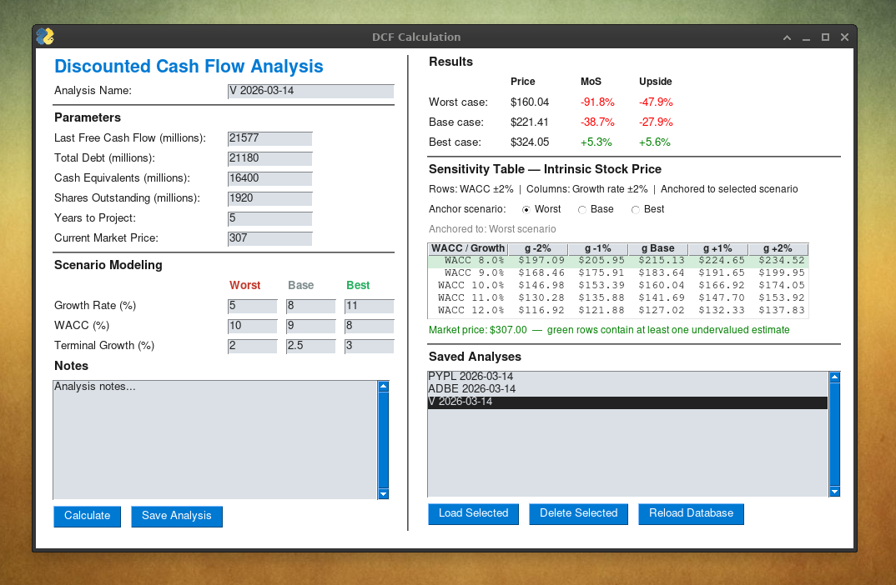

# DCF Valuation Tool


A Python desktop application for discounted cash flow analysis of publicly traded equities. Runs worst/base/best scenario modeling with a sensitivity table, margin of safety display, and Google Sheets database management.

---

## Overview

Built as a structured front-end for entering and persisting DCF analyses to Google Sheets. The analytical layer was added on top — providing scenario modeling, sensitivity analysis, and upside/MoS calculations — making it useful both as a data entry tool and a lightweight investment research aid.

---

## Features

- **Three-scenario DCF** — Worst / Base / Best with independent growth, WACC, and terminal growth rate inputs
- **Sensitivity table** — 5×5 grid varying WACC ±2% and growth rate ±2% around a user-selected anchor scenario; rows where any cell exceeds the market price are highlighted green
- **Results display** — intrinsic price, margin of safety (%), and upside (%) per scenario; colour-coded green/red
- **Notes field** — free-text field saved alongside the analysis
- **Google Sheets database** — save, load, and delete analyses; header is written automatically on first save
- **Scenario anchor selector** — sensitivity table can be re-anchored to Worst, Base, or Best without recalculating

---

## Requirements

```
Python 3.9+
FreeSimpleGUI
gspread
google-auth
```

Developed and tested on Linux. FreeSimpleGUI rendering may vary slightly by platform.

---

## Google Sheets Setup

The tool writes to a Google Sheet named `DCF DB`, sheet `DB`. Both names are configurable at the top of the script:

```python
CREDENTIALS_PATH = 'credentials.json'   # path to your service account JSON
SPREADSHEET_NAME = 'DCF DB'             # spreadsheet file name
SHEET_NAME       = 'DB'                 # worksheet tab name
```

1. Create a Google Cloud project and enable the Sheets and Drive APIs
2. Create a service account and download the JSON credentials file
3. Share the spreadsheet with the service account email address
4. Update `CREDENTIALS_PATH` to point to your credentials file

The sheet header is written automatically on first save.

---

## Input Parameters

| Field | Description |
|---|---|
| Analysis Name | User-defined label for the analysis |
| Last Free Cash Flow (M) | Most recent annual or TTM FCF in millions |
| Total Debt (M) | Total debt on the balance sheet |
| Cash Equivalents (M) | Cash and short-term equivalents |
| Shares Outstanding (M) | Diluted share count in millions |
| Years to Project | DCF projection horizon (typically 5–10) |
| Current Market Price | Optional — enables MoS, upside, and sensitivity table highlighting |
| Growth Rate (%) | FCF growth rate per scenario |
| WACC (%) | Weighted average cost of capital per scenario |
| Terminal Growth (%) | Perpetual growth rate after the projection period |

---

## Database Fields

| Field | Description |
|---|---|
| `analysis_name` | User-defined label |
| `last_fcf` | Last free cash flow (millions) |
| `debt` | Total debt (millions) |
| `cash` | Cash equivalents (millions) |
| `shares` | Shares outstanding (millions) |
| `years` | Projection years |
| `market_price` | Current market price |
| `pessimistic_growth` / `_wacc` / `_terminal` | Worst case scenario inputs |
| `middle_growth` / `_wacc` / `_terminal` | Base case scenario inputs |
| `optimistic_growth` / `_wacc` / `_terminal` | Best case scenario inputs |
| `notes` | Free-text notes |

---

## How the DCF Works

1. Projects FCF forward for the specified number of years using the scenario growth rate
2. Discounts each projected FCF back to present value using WACC
3. Calculates terminal value using the Gordon Growth Model: `FCF_n × (1 + g) / (WACC − g)`
4. Discounts terminal value to present value
5. Enterprise Value = sum of discounted FCFs + discounted terminal value
6. Intrinsic Value = Enterprise Value − Total Debt + Cash
7. Intrinsic Price = Intrinsic Value / Shares Outstanding

**Note:** WACC must be greater than the terminal growth rate. The model will raise an error if this constraint is violated.

---

## Sensitivity Table

The sensitivity table shows intrinsic price across 25 combinations of WACC and growth rate, centred on the anchor scenario. It is useful for identifying the break-even assumptions — the boundary where the intrinsic price crosses the market price. Rows containing at least one cell above the market price are highlighted green when a market price is entered.

---

## License

MIT
